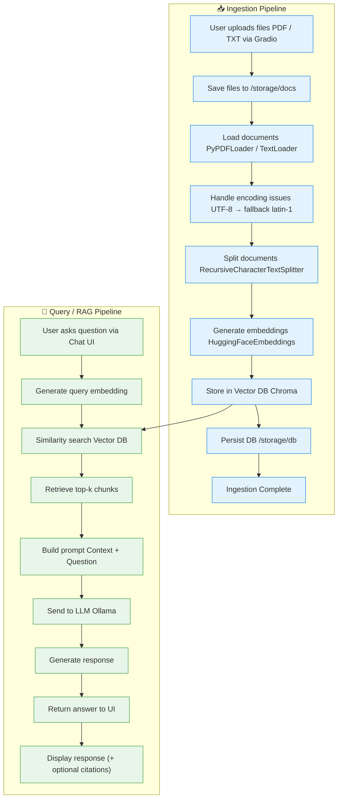

```mermaid
flowchart TD

%% =========================
%% INGESTION FLOW
%% =========================
subgraph INGESTION ["📥 Ingestion Pipeline"]
    A[User uploads files PDF / TXT via Gradio] --> B[Save files to /storage/docs]

    B --> C[Load documents PyPDFLoader / TextLoader]

    C --> D[Handle encoding issues UTF-8 → fallback latin-1]

    D --> E[Split documents RecursiveCharacterTextSplitter]

    E --> F[Generate embeddings HuggingFaceEmbeddings]

    F --> G[Store in Vector DB Chroma]

    G --> H[Persist DB /storage/db]

    H --> I[Ingestion Complete]
end

%% =========================
%% QUERY FLOW
%% =========================
subgraph QUERY ["💬 Query / RAG Pipeline"]
    J[User asks question via Chat UI] --> K[Generate query embedding]

    K --> L[Similarity search Vector DB]

    L --> M[Retrieve top-k chunks]

    M --> N[Build prompt Context + Question]

    N --> O[Send to LLM Ollama]

    O --> P[Generate response]

    P --> Q[Return answer to UI]

    Q --> R["Display response (+ optional citations)"]
end

%% =========================
%% CONNECTION BETWEEN FLOWS
%% =========================
G --> L

%% =========================
%% STYLING
%% =========================
classDef ingestion fill:#e3f2fd,stroke:#1e88e5,stroke-width:1px;
classDef query fill:#e8f5e9,stroke:#43a047,stroke-width:1px;

class A,B,C,D,E,F,G,H,I ingestion;
class J,K,L,M,N,O,P,Q,R query;
```